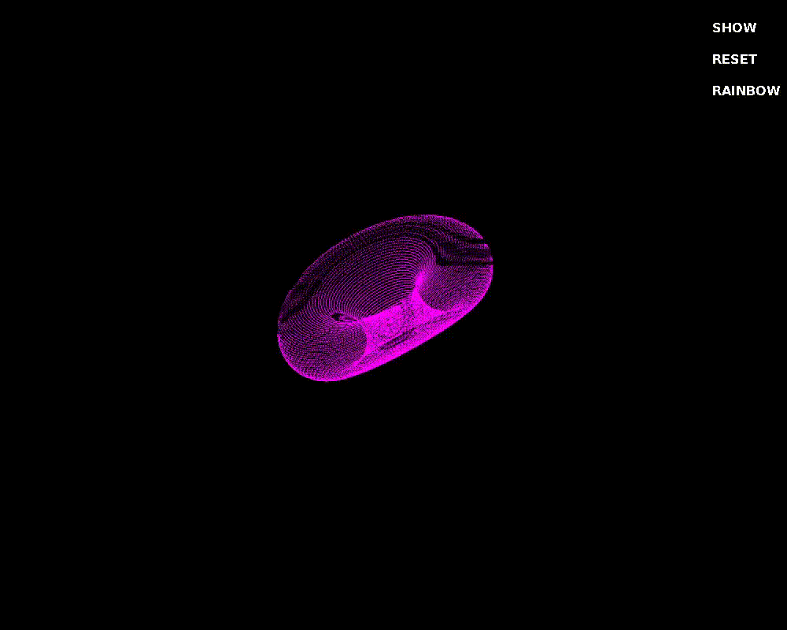

# Donut

    
    <em style="display: block; text-align: center;">Looks unfortunate here lol</em>

This project is inspired by the original donut.c file. 
I aimed to improve the efficiency of the rendering and calculations by optimizing the use of multithreading and lookup tables for trigonometric functions.

## Features

- Real-time 3D rendering of a rotating donut.
- Adjustable parameters for rotation speed, scaling, distance, and color.
- Interactive sliders to modify the donut's properties.
- Toggleable rainbow color mode.

### Dependencies

- SDL2
- SDL2_ttf
- pthread

---

#### Music Credits
Thanks to [captash999](https://tuna.voicemod.net/user/drysignaltremolo18561) for the Background Music!

    <em>Thank you for checking out my project. Feel free to reach out with any questions or feedback.</em>

